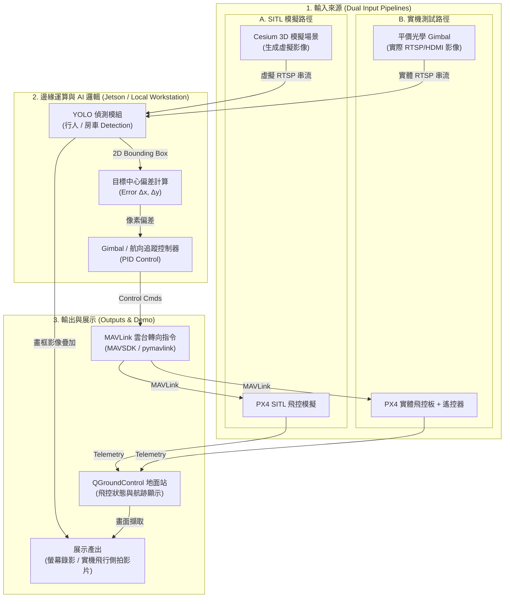

```mermaid
graph TD
    subgraph Inputs ["1. 輸入來源 (Dual Input Pipelines)"]
        direction TB
        subgraph SITL_Pipeline ["A. SITL 模擬路徑"]
            CESIUM["Cesium 3D 模擬場景<br>(生成虛擬影像)"]
            PX4_SITL["PX4 SITL 飛控模擬"]
        end
        subgraph REAL_Pipeline ["B. 實機測試路徑"]
            CAM["平價光學 Gimbal<br>(實際 RTSP/HDMI 影像)"]
            PX4_HW["PX4 實體飛控板 + 遙控器"]
        end
    end

    subgraph Processing ["2. 邊緣運算與 AI 邏輯 (Jetson / Local Workstation)"]
        YOLO["YOLO 偵測模組<br>(行人 / 房車 Detection)"]
        TRACKER["目標中心偏差計算<br>(Error Δx, Δy)"]
        PID["Gimbal / 航向追蹤控制器<br>(PID Control)"]
        
        YOLO -->|2D Bounding Box| TRACKER
        TRACKER -->|像素偏差| PID
    end

    subgraph Output ["3. 輸出與展示 (Outputs & Demo)"]
        QGC["QGroundControl 地面站<br>(飛控狀態與航跡顯示)"]
        GIMBAL_CMD["MAVLink 雲台轉向指令<br>(MAVSDK / pymavlink)"]
        RECORD["展示產出<br>(螢幕錄影 / 實機飛行側拍影片)"]
    end

    %% 資料流連結
    CESIUM -->|虛擬 RTSP 串流| YOLO
    CAM -->|實體 RTSP 串流| YOLO
    
    PID -->|Control Cmds| GIMBAL_CMD
    GIMBAL_CMD -->|MAVLink| PX4_SITL
    GIMBAL_CMD -->|MAVLink| PX4_HW

    PX4_SITL -->|Telemetry| QGC
    PX4_HW -->|Telemetry| QGC

    YOLO -->|畫框影像疊加| RECORD
    QGC -->|畫面擷取| RECORD
```
